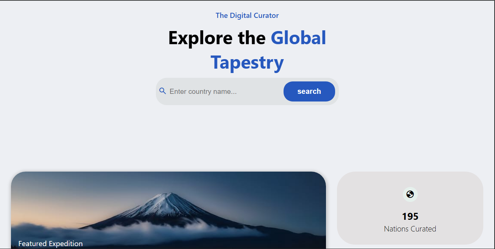

Country Finder

Country Finder is a simple web application that allows users to search for countries and view key information such as capital, population, region, languages, and currency.

Live Demo

"https://classik1127.github.io/country-finder/" (https://classik1127.github.io/country-finder/)

---

Features

- Search for any country by name
- View detailed country information, including:
  - Capital city
  - Population
  - Region
  - Languages
  - Currency
- Fast and responsive interface
- Clean and easy-to-use design

---

Tech Stack

- HTML5
- CSS3
- JavaScript (Vanilla JS)
- REST Countries API

---

Screenshots

Add screenshots of the application here to give users a quick preview.

()

---

Installation and Setup

To run this project locally:

git clone https://github.com/classik1127/country-finder.git
cd country-finder

Then open the "index.html" file in your browser.

---

How It Works

The user enters the name of a country into the search field. The application sends a request to an external API and retrieves relevant data about the country. This information is then displayed dynamically on the page.

---

Contributing

Contributions are welcome. To contribute:

1. Fork the repository
2. Create a new branch ("git checkout -b feature-name")
3. Make your changes
4. Commit and push your work
5. Open a pull request

---

License

This project is open source and available under the MIT License.

---

Acknowledgements

- REST Countries API
- Inspiration from geography-related applications